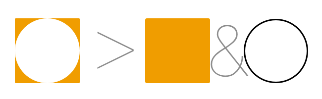
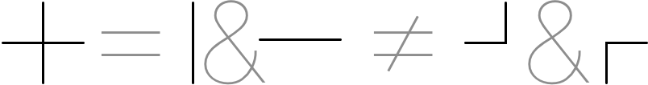

#GMT Abiturvorbereitung: Gestaltungsgesetze
_Johannes Hertenstein_

---

###Das ganze ist mehr als die Summe seiner Teile

Die Gesamtheit zählt, nicht **nur** das einzelne

---

###Figur & Grundbeziehung
Figur & Hintergrund sollten klar voneinander getrennt werden

*durch z.B. Kontraste, Kontur, Textur, Bewegung*

---

###Gesetz der Gleichartigkeit
Ähnliches (in Form, Farbe, Helligkeit) wird als zusammengehörig gesehen

---

###Gesetz der Nähe

Nahe liegende Elemente werden als zusammengehörig gesehen

__Das Gesetz der Nähe gilt __ ___stärker___ __ als das Gesetz der Gleichartigkeit__

---

###Gesetz der Geschlossenheit
Das Menschliche Hirn möchte immer geschlossene Flächen bilden. Wenn es diese nicht findet, so ergänzt es fehlende Teile, um eine solche Fläche / Form bilden zu können.

_Zu sehen sind hier drei ausgeschnittene Kreise, das Hirn "erfindet" eine weiße Fläche hinzu_

---

###Gesetz der durchgehenden Linie
Kreuzen sich 2 Linien, so wird davon ausgegangen, dass diese gerade weiter gehen

---

###Gesetz der Erfahrung
Das Hirn versucht immer bekannte Formen zu erkennen

---

###Gesetz der Innenseite
Der kleine Winkel wird immer als innen angesehen

---

###Prinzip der Prägnanz
Das Hirn sucht sich immer simple geometrische Grundformen (Kreis, Dreieck, Viereck… )
