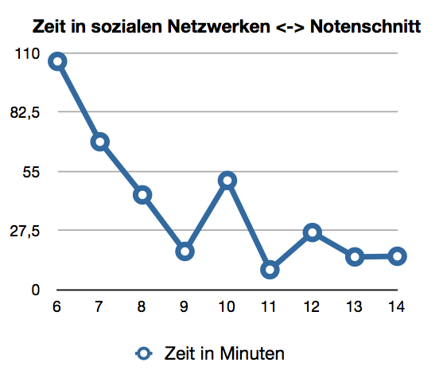
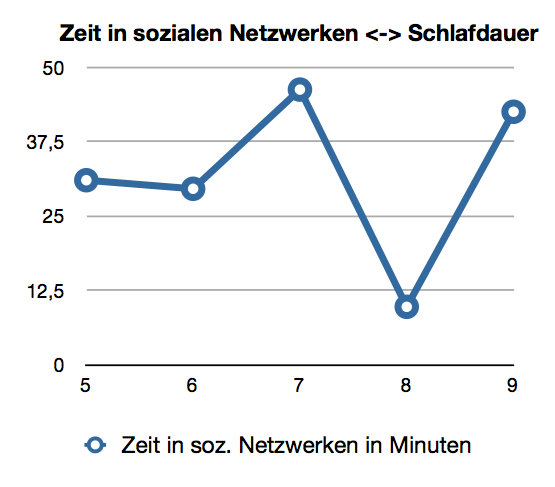

#Auswirkung des Internets auf die Gesellschaft
#####Johannes Hertenstein
*info: Dieses Dokument wurde teilweise automatisch zu Markdown geparst*

*Info2: Dies wurde Anfang 2012 geschrieben, in der Zwischenzeit hat sich einiges, besonders in Hinblick auf die Gesetzeslage geändert (und das nicht unbedingt in eine positive Richtung)*

---
## Inhalt
* 1 Einleitung
* 2 Was ist das Internet
* 3 Die Gesellschaft des Internets
	* 3.1 „Internet Slang“
	* 3.2 Foren & Chats
* 4 soziale Netzwerke
	* 4.1 Vorteile von sozialen Netzwerken
	* 4.2 Nutzung von soz. Netzwerken (Umfrageergebnisse)
* 5 Auswirkungen des Internets auf die Politik
	* 5.1 Politiker im Internet
		* 5.1.1 Politiker in soz. Netzwerken
	* 5.2 pol. Mitbestimmung durch das Internet
	* 5.3 Durch das Internet organisierte Aktionen
	* 5.4 Kritische Stimmen des Internets
	* 5.5 Wieviel Macht hat eine Regierung im Internet?
	* 5.6 „Friedliches zusammenleben“ von Politik und Internet
* 6 Schattenseiten des Internets
	* 6.1 Cybermobbing, Hacker & Trolle
	* 6.2 Piraterie
---

##1. Einleitung
Das Internet ist die wohl größte und für unsere Gesellschaft die Wohl bedeutendste Entdeckung des letzten Jahrhunderts. Eine Vernetzung auf internationaler Ebene, die weitreichende Folgen hat. In unserem Jahrhundert hat es großen Einfluss in verschiedenen Bereichen gewonnen und ist mittlerweile undenkbar geworden.

Doch ein Problem  hat das Internet: Es ist unkontrollierbar. Kein Mensch der Welt kann im Internet kontrollieren was in Umlauf gebracht wird und welche Gedanken Kreisen. Diese totale Freiheit wirkt natürlich auch in die Politik und den politischen Entscheidungsprozess des Bürgers mit. In der folgenden Ausarbeitung möchte ich dieses Themengebiet weiter erörtern.


---

##2. Was ist das Internet?
Technisch gesehen ist das Internet eine Vernetzung aus lauter Rechnern. In diesem Netzwerk sind (zumindest theoretisch) alle Rechner gleichbedeutend und es gibt keinen „bestimmenden“ Computer.

Durch diese Vernetzung der Rechner ist es möglich Datenaustausch über verschiede sogenannter Protokolle durchzuführen. Durch wiederum andere Programme wird dieser Datenstrom dann so umgewandelt, dass der Endnutzer etwas damit anfangen kann.


Die Vorteile des Internets dürften auf denr Hand liegen:


* Das Internet ist das mit Abstand schnellste Medium, das es gibt. Aktuellere Nachrichten sind nirgends zu finden.


* Das Internet ermöglicht Austausch von (u.U. kritischen) Gedanken und fördert somit die Gedankenfreiheit, da der Inhalt nicht kontrolliert werden kann


* Das Internet weiß alles. Google wird mittlerweile öfter nach Begriffen gefragt als ein Buch


* Das Internet ist (derzeit noch) Anonym. Jeder Nutzer kann sich selber entscheiden wie viel er von sich preisgibt und unter welchem Namen. Ein Großteil der Nutzer benutzen sogenannte Nicknames, also Kurz oder Kosenamen, um ihre eigentliche Identität zu verschleiern oder diese in den Hintergrund rücken zu lassen. Diese Anonymität wird gerade durch die Politik angeprangert und wird auch immer wieder Versucht durch Gesetzentwürfe wie z.B. ACTA abzuschaffen

---

## 3. Die Gesellschaft des Internets

###3.1 Einleitung
Da wir nun die technische Seite und die Vorteile des Internets kennengelernt haben, möchte ich Ihnen nun zeigen, wie denn die sogenannte „Netzkultur“, also die Gemeinschaft der Inernetnutzer und die daraus resultierenden Kommunikativen zusammenhänge, aufgebaut ist.

 Hierbei ist „Netzkultur“ nur auf die tatsächlichen Vielnutzer des Internets bezogen. Der Begriff „Netzkultur“ wird heutzutage (zu unrecht) für alle Zwecke missbraucht, in denen das Internet für Probleme hinhalten muss.

###3.2 „Internet Slang“
Wie in den meisten Fachkreisen hat sich auch im Internet eine Art Slang, oder eigener Dialekt entwickelt, der für Aussenstehende nur schwer verständlich ist.

Angefangen bei abstrakten Smileys, die noch nachvollziehbar sind `z.B. o_O ` bis hin zu Kombinationen wie `1337` oder `H4ck0rz`.

Einige Begriffe wie z.b. LOL (Lough Out Loud ≙ Lautloses Lachen) oder ROFL (Roll On Floor and Lough ≙ sich vor Lachen auf dem Boden krümmen) sind bei dem ein oder anderen teilweise schon in den normalen Sprachgebrauch eingegangen und zeigen somit die große Wirkung des neuen Mediums auf unsere Jugend (was nicht unbedingt negativ gemeint ist).


Ich möchte (Ihnen) nun an dem extremen Beispiel der sogenannten „Leetspeack“ zeigen wie weit ein solcher Slang reichen kann. Diese Spezielle Sprache wird selbst im Internet nicht dauernd genutzt sondern ist nur in bestimmten Gruppierungen zu finden.

Ursprünglich wurde Leetspeak tatsächlich zu der verschlüsselten Kommunikation zwischen tatsächlichen Hackern, also denjenigen, die tatsächlich in fremde Rechner eingedrungen sind, im Internet genutzt.

Mittlerweile hat Leetspeak keine Wirkliche Anwendung mehr, sondern wird nur genutzt um Nicknames eine größere ästhetische Wirkung zu geben (So wird aus Max m4x). In den Grundzügen werden bei Leetspeak verschiedene Zeichen oder Buchstaben durch andere ersetzt (z.b. 4 statt A oder 3 statt E).

Aus Johannes Hertenstein wird somit ein geheimnisvoll klingendes und auf den ersten Blick nicht Identifizierbares `j0h4nn35-h3rt3n5t31n`.


###3.3 Foren & Chats
Foren spielen in der sog. Netzkultur eine große Rolle. Sie werden genutzt als Austauschmittel für Leute mit besonderen Fähigkeiten, die sich nicht einfach Besuchen können um zu reden. Auch werden hier Probleme die Leute mit bestimmten Dingen haben öffentlich gemacht um die sog. Community (also die Gemeinschaft des Forums) und das ganze Internet an der Findung der Problemlösung zu beteiligen.


In Foren bildet sich jedoch schnell eine Stammgruppe, die ausstehenden im ersten Augenblick eher „feindlich“ gesinnt ist. In diesen Stammgruppen gibt es eine merkwürdige Eigendynamik, die es einem oft schwer macht sich neu in ein Forum hineinzufinden. So gibt es beispielsweise oft alte Forenwitze, die immer auftauchen und neue Nutzer eher abschrecken und unsicher machen.


Chats sind die Plauderrunden und Stammtische des Internets. Hier wird sich getroffen, unterhalten und vieles (vor allem Privates) besprochen. Hierin liegt auch der Unterschied zwischen Forum und Chat. In einem Chat treffen sich zwar meist auch Menschen mit ähnlichem Hintergrundwissen um zum Teil auch über technisches zu Reden, jedoch sind diese Unterhaltungen privater und kurzweiliger als Foren Threads (Einträge).

Die in Chats entstandenen Bekanntschaften können, und das vergessen viele Menschen, wenn sie über das Internet sprechen, auch ziemlich tief reichen. Viele Menschen verurteilen Internetbekanntschaften von Grund auf, da sie eine falsche, oder halbkomplette Sicht des Internets haben.

**Das Internet ist nicht nur bewohnt von Pädophilen und anderen zwielichtigen Gestalten, sondern von normalen Menschen**. Natürlicherweise findet man unter Millionen Menschen im Internet auch das ein- oder andere schwarze Schaf, jedoch ist das, gemessen am Standart eher in den wenigsten Fällen der Fall.

---
## 4. soziale Netzwerke
###4.1 Was sind soziale Netzwerke?
soziale Netzwerke sind das Arztwartezimmer oder das Café des Internets. Soziale Netzwerke haben den einzigen Sinn die innere Gier nach Selbstmitteilung eines Menschen zu Stillen.

In verschiedenen Sozialen Netzwerken können belanglose Einträge der ganzen Welt zugänglich gemacht werden. Dies wird manchmal extrem auf die Spitze getrieben (z.B. Einträge wie z.B. „Ich gehe auf das Klo“).

Soziale Netzwerke machen für den Betreiber wenig Arbeit. Sind sie einmal aufgesetzt laufen sie von alleine weiter und alles was benötigt wird ist jemand der aufpasst, dass nichts illegales passiert. Soziale Netzwerke leben den Web 2.0 Gedanken („Der Nutzer arbeitet, der Betreiber verdient“) perfekt aus, da auf sozialen Netzwerken oft Werbung geschalten wird.

Durch Analyse der zum Teil sehr privaten Einträge können nun Persönlichkeitsprofile erstellt werden um somit auf den jeweiligen Nutzer zugeschnittene Werbung zeigen zu können. Zu diesem Thema werde ich mich unter Punkt 5.2 (Daten sammeln) jedoch noch einmal gezielt äußern.

Wichtig ist, dass verschiedene soziale Netzwerke verschiedene Wege haben ihre Nutzer kommunizieren zu lassen. Youtube zum Beispiel basiert auf Videos und Kommentaren und darüber hinaus werden alle Aktion getätigt. Twitter dagegen basiert nur auf sehr kurzem Mitteilungen (max. 140 Zeichen) ohne Extras.

Facebook ist das mit Sicherheit aufgeblähteste soziale Netzwerk auf der Welt. Wo Twitter mit Einfachheit punktet ist Facebook vollgestopft mit Möglichkeiten. So z.B. ist es möglich Bilder, Videos, Links und Texte über Facebook zu teilen, genauso wie es möglich ist Spiele zu spielen, Wahrsagertests durchzuführen und sogar seine Amazon-Einkäufe zu teilen.



###4.2 Vorteile von sozialen Netzwerken
Vorteile von sozialen Netzwerken dürften auf der Hand liegen:


* soziale Netzwerke werden von den Nutzern selber mit Informationen gefüttert. Also Entscheiden die Nutzer selber in welche Richtung sich das Netzwerk entwickeln soll.

* soziale Netzwerke sind aktuell. Durch die große Bandbreite und physikalische Verteilung von den Nutzern über die ganze Welt sind soziale Netzwerke dazu in der Lage Geschehnisse schnell über den ganzen Globus zu verteilen.

* soziale Netzwerke sind fast nicht zu zensieren. Durch die große Aktualität der Beiträge ist eine Zensur nahezu unmöglich. Alles, was geschrieben wird, geht exakt so, bit für bit, Buchstabe für Buchstabe hinaus an die ganze Welt.

* soziale Netzwerke sind so Anonym wie man sie haben will. Es ist jedem Nutzer freigestellt seinen eigenen Namen oder einen falschen oder ein Synonym zu Nutzen. Die Nutzung von Synonymen ist im Internet insgesamt ein großer Schritt für die Anonymität.

* Wenn soziale Netzwerke richtig genutzt werden sind sie ein guter Weg der Koordination. Dies betrachte ich besonders in meiner Schulklasse, die eine Facebook Gruppe eröffnet hat mit dem Zweck Unterrichtsmaterialien und Vorbereitungsmaterial für Arbeiten auszutauschen, sowie Informationen zu Stunden die ausfallen oder Stundenplanänderungen.


###4.3 Nutzung von sozialen Netzwerken (Umfrageergebnisse)
Einer der am nächsten liegenden Fragen ist die Frage danach, wie soziale Netzwerke heute genutzt werden. Zu diesem Thema habe ich eine Umfrage gemacht, die allein über das Internet verfügbar war und zu einem großen Teil nur in sozialen Netzwerken geteilt wurde.

Dies tat ich nicht um wenig Arbeit zu haben, sondern ich wollte testen, wie viele Menschen ein einfacher Schüler, wie ich, erreichen kann. Die Ergebnisse waren erstaunlich: Nach knapp 2 Wochen nahmen fast 50 Personen teil, am Ende der Umfragen waren es 65. Doch nun zu den Ergebnissen: Die befragten waren zwischen 12 und 78 und im Schnitt ca. 20 Jahren alt.

Es wurde nach Beteiligung in verschiedenen Netzwerken gefragt, sowie nach Berufsstand, Schulabschluss, Notenschnitt in der Schule und Schlafzeit. Schüler waren mit 61% die größte Teilnehmergruppe der Umfrage,
dicht gefolgt von Angestellten (17%) und Studenten (15%). Die kleinste Gruppe waren Auszubildende mit 7%. Ähnliches spiegelt sich auch in der Statistik der Schulabschlüsse ab, da mit 72% fast Dreiviertel der Befragten ein Gymnasium besuchen (bzw. besuchten), der Rest besucht die Realschule, Hauptschüler war keiner der 65 Befragten.

Wir können hier also von einem etwas etablierterem  Publikum ausgehen, was auch der Durchschnittliche Notenschnitt von 10,25 Punkten (also eine Note von ca. 2,2) belegt. Da wir nun unser Publikum kennen, wollen wir uns etwas brisanteren Ergebnissen zuwenden: Ich möchte zuerst einen Blick auf die Zusammenhänge von Schulnoten und Zeit in sozialen Netzwerken betrachten.


Bei den Betrachtungen kam ich zu dem Ergebnis, dass es einen leichten Zusammenhang zwischen dem Notenschnitt und der verbrachten Zeit in sozialen Netzwerken gibt. In der Grafik ist zu sehen, dass es einen exponentiellen Abfall der im Schnitt in sozialen Netzwerken verbrachten Minuten gibt je höher man sich auf der Notenskala befindet. Dies ist auch einfach zu erklären: Je mehr Zeit man in sozialen Netzwerken verbringt, desto weniger hat man zu lernen oder anderes Sinnvolles zu unternehmen.



Interessanterweise besteht laut meiner Umfrage jedoch kein oder höchstens kaum ein Zusammenhang zwischen der Schlafdauer in Stunden und den verbrachten Minuten in Netzwerken.

---


##5. Auswirkung des Internets auf die Politik
Nachdem die komplette Welt weiß, was das Internet ist und wie es zu gebrauchen ist, bemerkt die Politik nun auch die Wichtigkeit dieses „neuen“ Mediums. Das Problem hierbei ist jedoch, dass viele Politiker nicht genau wissen wie das Internet funktioniert oder komplett falsche Vorstellungen haben.

Viele Unter- oder Überschätzen auch die Macht einer Internationalen, schnellen, anonymen Nutzergruppe im Internet. Auf den folgenden Seiten möchte ich dieses Thema verstärkt analysieren um am Ende einen Lösungsvorschlag zu machen, wie sich Politik und Internet ohne „Machtkampf“ entgegenkommen könnten. Auch möchte ich beleuchten, in welcher Weise das Internet Einfluss auf den politischen Entscheidungsprozess von Nutzern nimmt.

###5.1 Politiker im Internet
Jeder Mensch kann im Internet komplett zurückverfolgt werden und durch Gedankenlose Einträge in sozialen Netzwerken kann auch viel privates eines Menschen. Auch Politiker sind hier keine Ausnahme. 

Sie sind in diesem „Wertfreien Raum“ genauso gewichtet wie jeder Nutzer, auch wenn sie in der „reellen Welt“ denken sie seien wertvoller. Wichtig ist für den Politiker, richtig auf sein Publikum zuzugehen und nicht mit Unwissenheit über das Internet zu (negativ) zu Punkten.

Ein grundsätzliches Verurteilen des Internets, wie es viele Politiker leider immer noch tun ist komplett fehl am Platz. Das Internet sollte politisch zu einem Thema werden wie jedes andere Medium. Dazu müsste es jedoch von der Politik als voll genommen werden. Und das fängt bei jedem kleinen und großen Politiker an.



####5.1.1 Politiker in sozialen Netzwerken
Unter Politikern gibt es in Bezug auf soziale Netzwerke 2 große Meinungen, die Unterschiedlicher nicht sein könnten. Die einen Nutzen soziale Netzwerke auf einem Sinnvollen Wege, um direkt mit den Wählern verbunden zu sein und um diesen auch sympathischer zu erscheinen.

Das Macht auf jeden Fall Sinn, da knapp 3/4 aller Deutschen Bürger direkt per Internet erreichbar und bei unter 30-jährigen ist das Internet sogar das wichtigste Medium zur politischen Informationsbeschaffung. 3/4 der Deutschen Bundesbürger sind sehr viele, gerade wenn man bedenkt, dass laut Bundesinstitut für Bevölkerungsforschung ca. 26% der Bundesbürger über 65 Jahre alt sind.

Da die politische Meinung dieser Altersgruppe wenig bis gar nicht zu beeinflussen ist, kann gesagt werden, dass fast jeder für die Parteien wichtige beeinflussbare Bundesbürger per Internet erreichbar ist. Einige Parteien haben dies auch bemerkt und eine umfangreiche Internetplattform aufgebaut, um ihre Bürger zu informieren.

Internetnutzer wollen jedoch niemanden, der sie mit Informationen füttert. Internetnutzer benötigen jemanden, der sich wie ein Freund gegenüberstellt, der auf die selbe Stufe wie sie steigt und sich dort mit ihnen unterhält und da kommen soziale Netzwerke ins Spiel. In sozialen Netzwerken ist Grundsätzlich jeder gleichgestellt, keiner ist mehr Wert als ein anderer, alle Stehen auf der selben Stufe.

Ein Politiker kann einem normalen Bundesbürger begegnen ohne Bodyguard, ohne viel umher und sich mit diesem über aktuelle Themen unterhalten. Um einen Vergleich aufzustellen ist eine Internetplattform einer Partei ungefähr wie der Zeitungsjunge. Er gibt ihnen eine Zeitung, wenn sie denn eine wollen und diese müssen sie dann selber lesen. Auf diesem Wege erreicht man also nur Menschen, die sich ohnehin schon politisch Informieren wollten. 

Ein Politiker jedoch, der sich in einem sozialen Netzwerk als Freund gegenüberstellt ist in etwa wie jemand, der sich zufällig in einem Café neben einen setzt und anfängt sich mit ihnen über Neuigkeiten zu Unterhalten. Durch diesen zufälligen, geselligen Charakter kann ein viel weiteres Spektrum an Menschen erreicht werden und vor allem diejenigen, die sich politisch nicht Informieren wollten und die sind natürlicherweise am leichtesten zu überzeugen, da sie die Gegenpositionen nicht kennen.

Diesen Politikern gegenüber stehen natürlicherweise diejenigen, die das Internet als Hexenwerk verteufeln und nur schlechtes in diesem Medium sehen. Über diese Menschen kann man sich aufregen oder auch nicht. Wenn man es realistisch betrachtet war es schon immer so: Die meisten direkten politischen Mitbestimmer verweigern sich vehement allem Neuen, das nicht von ihnen kommt.

Bei einem Blick in die Vergangenheit wird klar: ein neues Phänomen ist das nicht. Schon zu früheren Zeit war dies so. Als Galilei seine Vorstellung von einer runden Erde vorstellte wurde er von den damaligen Machthabenden, der Kirche, verurteilt und es wurde ihm der Mund verboten. Und trotzdem hat sich die Idee einer runden Erde durchgesetzt und ist mittlerweile Wissenschaftlich anerkannt.

So wird es auch mit dem Internet geschehen. Das Problem nur ist: Die „Internetzeit“ läuft, aufgrund der großen Aktualität und Datenflut, um einiges schneller als es die reelle tut. Jedoch ist auch hier Vorsicht geboten für die Politiker: man sollte sich nicht Gedankenlos auf die Neuerungen einlassen. Natürlich muss jeder Mensch aufpassen was er im Internet von sich gibt , jedoch trifft das, wie schon gesagt, besonders auf die Politik zu.

In einem Tagesspiegel Interview berichtet David Mcallister, seinerzeit Ministerpräsident in Niedersachsen von einem Parteikollegen, der während einer Parteiveranstaltung über seine wohl wohlschmeckende Wurst twitterte. Dieser Parteikollege wurde von Mcallister darauf aufmerksam gemacht, dass es niemanden interessiere, wie seine Bratwurst  schmecke. Weiterhin sagte er „Nicht alles, was in sozialen Netzwerken passiert, ist auf Anhieb nachvollziehbar. Jeder teilt jedem mit, was er gerade macht, denkt und fühlt. [...] Es fällt mir manchmal schwer, den persönlichen oder gesellschaftlichen Mehrwert zu erkennen.“

####5.2 politische Mitbestimmung durch das Internet
Dass sich viele deutsche Bundesbürger über das Internet ihre politische Meinung bilden, haben wir ja schon in einem früheren Teil gesehen. **Wie ist es nun jedoch mit politischer Mitbestimmung durch das Internet?** Was tut unsere Regierung um die sog. „digital natives“, also diejenigen die mit dem Medium Internet / Computer zusammen aufgewachsen sind, aktiv an dem deutschen Regierungssystem teilhaben zu lassen?

Die deutsche Bundesregierung steht in diesem Fall sogar relativ gut da. Dies ist jedoch keine eigene Errungenschaft, sondern die Umsetzung des Verlangens nach politischer Transparenz in das Internet. Die im Dezember 2004 für den Hamburger Landtag erschaffene Internetplatform abgeordnetenwatch.de ermöglicht es online Fragen an Abgeordnete des Landesparlaments zu stellen.

Fragen werden vom Betreiber der Website, der Parlamentwatch e.V., an den jeweiligen abgeordneten weitergeleitet und dann auf der Webseite veröffentlicht. Der Wirkungsradius der Webseite beschränkt sich mittlerweile jedoch nicht mehr nur auf das Hamburger Landesparlament, sondern erstreckt sich mittlerweile über ganz Deutschland, dem Bundestag, sowie teilweise bis in das Europaparlament. 





####5.3 Durch das Internet organisierte politische Aktionen
Die Nutzer, die natürlicherweise das Internet gut kennen und schätzen gelernt haben, erkennen seinen großen Wert, gerade in Bezug auf die Politik. Leider ist die Politik auf diesem Gebiet noch auf Kinderschuhen, während die Nutzer durch die Freiheit des Internets ihre allgemeine Freiheit als grenzenlos ansehen.

Hierin sehen Regierungen aller Art ein Problem. Sie fühlen sich bedroht von diesem neuen, mächtigen, globalen Medium, sodass sie ihr bestes Tun wollen um ihre Bevölkerung davor zu schützen. Sie sehen jedoch nicht, dass die Nutzer mittlerweile gelernt haben sich selbst zu beschützen und die „Schutzmaßnahmen“ also als Einschränkung der Freiheit sieht.

Relativ aktuell ist die zum Beispiel im Fall ACTA. ACTA ist ein Gesetzentwurf, der den Providern, also den Internetbereitstellern, auferlegen soll, Daten auf Urheberrechtlich geschütztes Material zu untersuchen. Die Community des Internets sieht dies jedoch als einen Angriff auf ihre persönliche Freiheit, Anonymität und vor allem auf die Privatsphäre.

Eine Suche nach Urheberrechtlich geschützten Material würde nämlich die Offenlegung aller persönlicher Datentransfers durch den Provider bedeuten. So wären private eMails nicht mehr privat und vermeintlich sichere Geschäfte nicht sicher, man weis ja nie, wer am anderen Ende der Daten sitzt.

Die durch ACTA ausgelösten Protestaktionen waren die ersten ihrer Größe und wurden komplett durch das Internet organisiert. Diese Proteste haben zu einer temporären Ablehnung des Gesetzesentwurfs geführt. Dies war natürlicherweise ein großer Erfolg für die deutsche Online-Gemeinde und zeigt wozu dieser große Teil der Bevölkerung Deutschlands und der ganzen Welt im Stande ist.

In München allein waren es bei der ersten Demo 16.000 Menschen die gegen diesen Entwurf demonstrierten, in Berlin 10.000. Insgesamt wurde 64mal an 2 Terminen in verschiedenen Städten demonstriert. Eines steht fest: noch nie verbreitete sich Gedankengut so schnell wie heute. von den Insgesamt 64 Demonstrationen waren alleine 62 an dem 2. Termin.






####5.4 Kritische politische Stimmen aus dem Internet
Das Internet, der Inbegriff der absolute Freiheit, auch der Gedankenfreiheit. Wie sieht es aus in dieser großen, vernetzten Freiheit, wo sind die Kritiker? Kritiker gibt es im Internet mehr als genug.

Hier tritt übrigens wieder ein Problem des Internets auf. Da jeder anonym ist kann jeder vorgeben gut informiert und gut durchdacht zu sein. Oft trifft man, gerade bei extrem kritischen Stimmen, auf Pubertäre „digital natives“ oder solche, die es gerne seien. Oft versuchen Menschen mit einem geringen Selbstwertgefühl sich im Internet durch das Vertreten extremer Positionen auszudrücken.

Hier ist also, mehr als in der „reellen Welt“ Vorsicht geboten bei der Auswahl an kritischen Stimmen. Diese jedoch stehen, natürlicherweise, oft in Konflikt mit der Regierung. Das Problem besteht nun darin, dass Regierungen die Macht haben diese Kritiker mundtot zu machen.

Ein schönes Beispiel ist der Fall **Wikileaks**.

**Was ist Wikileaks?**

>„Wikileaks ist ein unzensierbares Wiki für die massenhafte [...] Veröffentlichung und Analyse von geheimen Dokumenten“

so erklärt sich Wikileaks auf ihrer Website wikileaks.org selber. Wikileaks veröffentlich seit 2006 geheime Dokumente von Regierungen um somit die Bürger darüber zu informieren, was ihre Regierungen machen.

Das Dilemma um den „Untergang“ von Wikileaks begann jedoch 2010, nachdem ein Video auf Wikileaks veröffentlich wird, dass zeigt wie Amerikanische Soldaten in Afghanistan aus einem Helikopter auf Zivilisten schießen, obwohl sie wissen, dass diese keine Gefahr darstellen.

In einer riesigen Vertuschungsaktion schaltete die Amerikanische Regierung Wikileaks ab und zwang Unternehmen, wie zum Beispiel die Onlinebank paypal, Wikileaks nicht mehr zu Unterstützen. Dies ist ein großer Beweis Amerikas Macht auf das Internet. Dieses Beispiel leitet uns zu der nächsten großen Frage.









#####5.5 Wieviel Macht haben Regierungen im Internet?
`Dieser Teil der Arbeit kann sich nicht auf Quellen oder sonstiges berufen, da sich hier meine persönliche Sichtweise, die ich durch langes Studium dieses Mediums erlangt habe, widerspiegelt.`

Wenn man von vielen, im Internet organisierten, politischen Aktionen hört, die Regierungen immer wieder hart kritisieren und sogar direkt angreifen, sodass diese in ihre Entscheidung beeinflusst wird, so stellt sich doch sehr schnell die Frage: „Wieviel Macht haben Regierungen im Internet?“ oder anders formuliert: „Was können Regierungen gegen (übertriebene-) Internetpropaganda tun?“.

Ein Problem für Regierungen könnte die „Freizügigkeit“ des Internets sein. Jeder kann schreiben was er will, wann er will und wo er will. Die Internetcommunity ist ein schon längst abgefahrener Zug für Regierungen, die ihre Bürger vor dem Internet „schützen“ wollen. Regierungen können zwar eine direkte Abschaltung von Internetzugängen veranlassen, jedoch zeigen die Ausschreitungen in Ägypten, dass viele Menschen dann kreativ werden.

>„Egypt can use this number for dial up: +33172890150 (login 'toto' password 'toto') - thanks to a French ISP (FDN) #egypt #jan25“

so twitterte der Computersicherheitsexperte Jacob Appelbaum aka @ioerror am 28 Januar 2011. In dem Tweet wird eine Telefonnummer samt Zugangsdaten übermittelt um über eine reguläre Telefonverbindung sich in das Internet einzuwählen.

Diese Nachrichten wurden natürlich(erweise) nicht nur über das Internet verbreitet, sondern auch unter der Hand, sodass es, soweit man die richtigen Leute kannte, einfach war einen Internetzugang und somit wiederum Zugang zu der großen vernetzten Welt zu bekommen.

Es ist mittlerweile sehr schwer, bis sogar unmöglich das Internet komplett zu unterdrücken und zu verbieten. China ist derzeit das Land, das noch am erfolgreichsten ist. Noch schwerer zu realisieren ist eine Überprüfung von Daten und eine Blockierung von (von der Regierung ungewollten) Informationen umzusetzen, da eine unvorstellbare Datenmenge jede Sekunde das Internet betritt und verlässt.

Dabei wären Serversperren einfach, bei Projekten, wie z.b. dem Tor Netzwerk, bei dem der Inhalt auf vielen Privatrechnern verteilt liegt und kein Rechner von einem anderen weiß, wer er ist, wird eine solche Sperre tatsächlich unmöglich, da die Regierung dann zwar weiß, wo im Internet sich gefährliche Informationen finden lassen, sie jedoch nicht wissen auf welchem der Millionen Privat PCs sich diese Informationen befinden.

#####5.6 Ist ein „friedliches Zusammenleben“ von Internet und Regierung möglich?
Nach so vielen Informationen über Aktionen gegen die Projekt aus dem Internet heraus stellt sich schnell eine nächste Frage: Ist es möglich, dass das Internet und die Regierung friedlich miteinander auskommen können? Die kurze Antwort ist „Ja“.

In vielen Ländern, wie z.B. Deutschland leben die Internetcomunity und die Regierung in relativem Frieden miteinander. In Deutschland meldet sich die Community erst (politisch) zu Wort, wenn das Internet an sich bedroht ist, wie zuletzt durch ACTA.

ACTA war ein Gesetzentwurf, der es Internetanbietern (Providern) erlaubt hätte, durchgehende Daten zu scannen. Die Ausmasse der durch diesen Entwurf ausgelöste Ereignisse lässt sich unter Punkt 5.3 (Durch das Internet organisierte politische Aktionen) nachlesen. Der normale Internetnutzer hat normalerweise kaum ein Auge auf politische Entscheidungen, die das Internet betreffen.

Hätte die Community also keine Menschen, die darauf achten, könnte die Regierung mit dem Internet machen was sie wollte. Wenn sie aber vorhanden sind, sind Regierungen im Internet die Hände gebunden, da falls sie etwas machen sich viele Internetnutzer gegen sie auflehnen. Solange Regierungen also nichts machen, das die grundsätzliche Existens des Internets oder die Sicherheit des Nutzers gefährden könnte, haben Internet und Politik es leicht mit einander.

---

##6. Schattenseiten des Internets
Das Internet ist in vielen Augen ein Medium voller Unschönheiten und introvertierten Menschen. Oft wird so aus Einzelfällen und wenigen Menschen auf die große Gemeinheit geschlossen, wie dies bei vielen Dingen der Fall ist. Ich möchte nun die „dunklen Seiten“ und die Unterschiede verschiedener „boshafter“ Internetnutzer genauer erläutern.





###6.1 Cybermobbing, Hater und Trolle
Ein viel diskutiertes Thema ist Cybermobbing. Unter der Gesellschaft, die nicht so internetbezogen ist, ist der Term Cybermobbing, der sich aus Cyber (von Cyberspace, dem Internet) und dem gewöhnlichen Mobbing zusammensetzt, als Übergriff sehr beliebt. Jedoch wird Cybermobbing von Internetnutzern nur verwendet, wenn ein Mensch in einem sozialen Netzwerk von anderen, ihm bekannten, Individuen gemobbt wird.

Ähnliche Phänomene stellen Hater und Trolle dar. Ich möchte nun erst einmal auf Hater eingehen. Hater sind generell und oft ohne Grund darauf aus, jemanden zur Weißglut zu bringen. Der Unterschied zum (Cyber-)mobbing besteht darin, dass Hater ihre Opfer meistens gar nicht persönlich kennen, sondern nur über ihre Publikationen im Internet (Youtube ist hier ein gutes Beispiel).

Ihnen ist der publizierte Inhalt oft egal und sie wollen sich nur über ihre Opfer auslassen, da sie ihren Opfern ihre Internetbekanntheit nicht gönnen. Von Menschen die dies kennen und davon wissen wird dies jedoch meist ignoriert und sogar als Merkmal von Bekanntheit gesehen. In einem Privaten Interview über Chat bestätigte mir der Fotograf, Vieltwitterer und Youtuber Tim Schropp

>„Hater sind ein Erfolgsindikator“

 

Tim Schropp publiziert schon seit mehr als 5 Jahren erfolgreich seine Fotografien in dem Fotobasierenden Sozialen Netzwerk „flickr“ und ist somit zu einem „kleinen großen“ im Internet herangewachsen. Hater sind im Prinzip die „Jungs von der Straßenecke, die man lieber nicht anspricht“ im Internet.

Da wir nun wissen was es mit Hatern auf sich hat, wollen wir uns einmal Trollen zuwenden. Das Wort Troll rührt von Ursprünglich von einer speziellen Art zu Angeln her, bei der man mit einem Boot langsam durch das Wasser fährt und mir einer Schleppangel Fische ködert. Dieses Ködern ist was das Wort Troll in das Internet gebracht hat.

Ein Troll ist eine Person die verschiedene Methode nutzt um andere auf die Schippe zu nehmen und damit einen richtigen Informationsfluss zu unterbrechen.Sie „ködern“ mit speziellen, provozierenden, zum Teil extra mit Falschinformationen gespickten Beiträgen, um den Groll und Ärger der Community auf sich zu ziehen. Oft haben Trolle viele verschiedene Accounts bei einem Netzwerk, um von vielen verschiedenen Standpunkten aus wirken zu können. 

>„Die meisten Trolle sind mit ihrem eigenen Leben nicht zufrieden“


so Yannik Bloschek, ein junger, deutscher Programmierer, der als sogenannter „digital native“ mit dem Internet gemeinsam aufgewachsen ist und somit das Internet gut kennt. Dies beschreibt den typischen Troll sehr gut, da sie mit ihrem eigenen Leben nicht klarkommen und sich deswegen eine „starke Persönlichkeit“ im Internet bilden.


###6.4 Piraterie
Ein stark durch die Medien aufgebauschter Themenbereich ist Piraterie im Internet. Als Piraterie wird das unerlaubte kopieren von Software, Musik oder ähnlichen digitalen Daten bezeichnet. Dieser Vorgang wird oft fälschlicherweise als Diebstahl bezeichnet, was nicht korrekt ist, da bei einem Diebstahl das entwendete am Ende sich nicht mehr an dem Ursprungsort befindet.

Bei Piraterie werden jedoch nur kopien gemacht, bei denen das Original unbeschadet bleibt. Natürlicher kommt trotzdem ein Schaden bei den Vertreibern zustande. Viele „Hacker“ mögen gerne die Herausforderung, Software zu knacken, so dass man sie kostenlos nutzen kann. Sie tun dies nicht, weil sie das Programm unbedingt benötigen, sondern weil sie Spaß daran haben die Sperren zu umgehen.

Diese wiederum veröffentlichen ihre Ergebnisse im Internet und machen sie dann anderen zugänglich. Das Problem entsteht nun, wenn der Hersteller (bzw. der Vertreiber) etwas gegen diese Schwächen tun will und zusätzliche Sperren einbaut.

Der „Hacker“ sieht sich nun herausgefordert und bricht auch durch diese Sicherheitsbestimmungen. Daraufhin baut der Hersteller wieder neue Sicherheitsmaßnahmen ein. Auf diese Weise schrauben diese beiden Parteien sich gegenseitig hoch und das zu Lasten des Endverbrauchers. Der Hersteller steckt mehr Geld in die Entwicklung neuer Sicherheitsmechanismen, als in die Weiterentwicklung des eigentlichen Produkts.



Dirk Ploss veröffentlichte auf seinem Blog derploss.posterous.com zu diesem Thema nebenstehende Grafik, die einen neuen, aus diesem Dilemma entspringenden, Punkt zeigt um zum Raubkopierer zu werden: Durch vielfache Sicherheitssperren, die dem Endverbraucher zur Last fallen wird es so umständlich z.b. einen Film anzuschauen, dass es einfacher und unkomplizierter ist diesen zu „stehlen“.



---


###7. Quellen

* 1 Einleitung


* 2 Was ist das Internet?
	* 2.1 Technische Sicht
		* http://de.wikipedia.org/wiki/Server
		* http://de.wikipedia.org/wiki/Internet
	* 2.2 Welche Vorteile bringt es?
		* http://homepage.univie.ac.at/birgit.stetina/flskryspin/archiv/vornachteile.PDF
		* http://www.eberl.net/dk/d_vorteile.html

		
* 3 Die Gesellschaft des Internets
	* 3.1 Einleitung
	* 3.2 „Internet-Slang“
		* http://de.wikipedia.org/wiki/Netzjargon
		* http://www.internetslang.com/
		* http://de.wikipedia.org/wiki/Leetspeak
	* 3.3 Foren
		* http://de.wikipedia.org/wiki/Internetforum
	* 3.4 Chatrooms
		* http://de.wikipedia.org/wiki/Chat

		
* 4 soziale Netzwerke 
	* 4.1 Was sind soziale Netzwerke
		* http://vibelle.fit.fraunhofer.de/bildung/netzwerke/395-was-sind-soziale-netzwerke
		* http://padlive.de/2011/04/soziale-netze-zum-zerreisen-gespannt/
	* 4.2 soziale Netzwerke im Überblick
		* 4.2.1 Twitter
			* http://twitter.com
			* http://de.wikipedia.org/wiki/Twitter
		* 4.2.2 Google+
			* http://google.com/plus
			* http://de.wikipedia.org/wiki/Google%2B
		* 4.2.3 Youtube
			* http://youtube.com
			* http://de.wikipedia.org/wiki/YouTube
		* 4.2.4 Facebook
			* http://facebook.com	
			* http://de.wikipedia.org/wiki/Facebook
	* 4.3 Vorteile von sozialen Netzwerken
		* http://samanthahutter.wordpress.com/
		* http://alexandra-doell.suite101.de/pro-und-contra-soziale-onlinenetzwerke-a60491
	* 4.4 Nutzung von sozialen Netzwerken (Umfrageergebnis)
		* eigene Quelle (http://abi.thephpjo.de)
	* 4.5 Auswirkung von sozialen Netzwerken auf die Politik
		* http://www.spiegel.de/spiegel/0,1518,742430,00.html
		* https://twitter.com/#!/ioerror/statuses/31030346854170624

* 5 Auswirkungen des Internets auf die Politik
	* 5.1 Politiker im Internet
	* 5.1.1 Politiker in sozialen Netzwerken
		* http://hofferer.org/politik/politiker-soziale-netzwerke-internet-demokratie-retten/
		* http://www.zeit.de/politik/deutschland/2011-07/politiker-twittern-baer-jarzombek
		* http://www.thueringer-allgemeine.de/web/zgt/politik/detail/-/specific/Landespolitiker-in-sozialen-	* Netzwerken-nur-selten-aktiv-1902248733
	* 5.1.2 Politiker vs. Community oder die Westerwelle bewegung
	* 5.2 Politische mitbestimmung durch das Internet
		* http://tcityforschung.wordpress.com/2011/09/29/studie-auswirkungen-des-internets-auf-die-politische-kommunikation-und-partizipation/
		* http://www.abgeordnetenwatch.de/faq-471-0.html
	* 5.3 Durch das Internet organisierte politische Aktionen
		* http://carta.info/38129/die-facebook-revolution-gedanken-zum-einfluss-des-internets-auf-politische-umbrueche/
		* https://twitter.com/ioerror/statuses/31030346854170624
		* http://www.stopacta.de/werde-aktiv-2/demonstrationen-25-02-2012/
		* http://www.golem.de/news/acta-demos-zehntausende-gegen-bekacta-scheiss-in-muenchen-und-berlin-1202-89718.html
	* 5.4 Kritische Stimmen des Internets
		* http://wikileaks.org/wiki/Wikileaks/de
		* http://de.wikipedia.org/wiki/WikiLeaks
	* 5.5 Wieviel macht hat eine Regierung im Internet?
	* 5.7 „Friedliches zusammenleben“ von Politik und Internet
		* http://www.golem.de/news/acta-demos-zehntausende-gegen-bekacta-scheiss-in-muenchen-und-berlin-1202-89718.html
	* 5.8 Das Internet als globale Demokratisierung?

* 6 Schattenseiten des Internets
	* 6.1 Cybermobbing (Hater / Trolle)
		* http://www.www-kurs.de/soziale_netzwerke.htm
		* http://wiki.coldmirror.net/wiki/Hater (Artikel über Hater, Trolle & co von einer Youtuberin)
		* (http://wiki.coldmirror.net/wiki/Poop)
		* http://www.urbandictionary.com/define.php?term=hater
		* http://www.derwesten.de/spiele/hintergrund/ich-bin-hater-und-das-ist-auch-gut-so-id755360.html
		* Interview mit Tim Schropp
		* Interview mit Yannik Bloschek
	* 6.2 Datensammel
		* http://www.handelsblatt.com/technologie/it-tk/it-internet/google-und-co-wettlauf-der-datensammler-im-internet-seite-2/3054398-2.html
		* http://www.spiegel.de/netzwelt/web/0,1518,758320,00.html
	* 6.3 Hacker
		* http://de.wikipedia.org/wiki/Hacker
		* http://de.wikipedia.org/wiki/Hackerethik
		* http://ccc.de/
	* 6.4 Piraterie
		* http://www.raubkopierer-sind-verbrecher.de/was-ist-eine-raubkopie.htm
		* 6.4.1 Warum Raubkopieren?
			* http://derploss.posterous.com/warum-raubkopien-mehr-spa-machen
			* http://gaming.justnetwork.eu/2012/01/12/notch-erlaubt-minecraft-raubkopien/
		* 6.4.3 Server im Ausland
			* http://www.finanztip.de/recht/online/a-lex29.htm
			* http://seouxindianer.de/blog/impressumspflicht-serverstandort-ausland/
			* http://www.vbulletin-germany.org/showthread.php?452-Server-im-Ausland/page2&s=64bac8398f56bf437f16e4b5845f6784 (wirkt nicht zu seriös)
		* 6.4.4 Torrent System
			* http://www.bittorrent.com/intl/de/help/faq/concepts
			* http://de.wikipedia.org/wiki/BitTorrent
			* http://bittorrent-faq.de/
	* 6.5 „alte Medien“ vs. „neue Medien“
		* 6.5.1 Das Internet und das Urheberrecht
			* http://www.golem.de/1107/85350.html
			* http://www.golem.de/1107/84789.html
			* http://www.telekom-presse.de/Der_sinnlose_und_schaedliche_Krieg_der_Filmindustrie_gegen_das_Internet.id.18453.htm
		* 6.5.2 Youtube: „Dieses Video ist in ihrem Land nicht verfügbar“
			* https://groups.google.com/a/googleproductforums.com/forum/#!category-topic/youtube-de/generelle-fragen/UplqrrhlVsc
			* http://netzpolitik.org/2011/%E2%80%9Edieser-content-ist-in-deinem-land-nicht-verfugbar-da-er-aufgrund-einer-regierungsanfrage-entfernt-wurde-%E2%80%9C/
			* http://www.spiesser.de/meinung/dieses-video-ist-deinem-land-nicht-verf%C3%BCgbar
		* 6.5.3 USA: PIPA & SOPA
			* http://www.telekom-presse.de/Der_sinnlose_und_schaedliche_Krieg_der_Filmindustrie_gegen_das_Internet.id.18453.htm
			* http://de.wikipedia.org/wiki/Stop_Online_Piracy_Act
			* http://en.wikipedia.org/wiki/PROTECT_IP_Act
			* http://www.pcworld.com/article/248298/sopa_and_pipa_just_the_facts.html
		* 6.5.4 Grooveshark
			* http://www.chip.de/news/Grooveshark-GEMA-zwingt-Musik-Stream-in-die-Knie_53835079.html
			* http://www.zeit.de/kultur/musik/2012-01/grooveshark-ende-deutschland
			* http://grooveshark.com/
	* 6.6 rechtliche Grauzonen
		* 6.6.1 OnlineTVRecorder
			* http://de.wikipedia.org/wiki/OnlineTVRecorder
			* http://onlinetvrecorder.com
			* http://forum.chip.de/rund-um-software/onlinetvrecorder-com-legal-1345747.html
		* 6.6.2 Streaming
			* http://www.winload.de/news/filme/kino-filme-als-stream-legal-oder-illegal-ein-rechtsanwalt-gibt-antwort/
			* http://www.e-recht24.de/artikel/urheberrecht/6558-kinoko-sind-streaming-filmportale-legal-oder-illegal.html



* http://www.bpb.de/publikationen/VNWAOH,0,0,Mehr_Demokratie_via_Internet.html

* Statistiken Deutschlands:
	* http://www.bib-demografie.de/cln_090/nn_750446/SharedDocs/Publikationen/DE/Download/Abbildungen/02/a__02__12__ag__20__65__80__d__1871__2060__saeulen,templateId=raw,property=publicationFile.pdf/a_02_12_ag_20_65_80_d_1871_2060_saeulen.pdf 

* http://www.bib-demografie.de/nn_750446/DE/Download/02/bevoelkerungsbilanz__und__altersstruktur__node,gtp=965522__3D4.html?__nnn=true

* http://de.statista.com/statistik/daten/studie/1365/umfrage/bevoelkerung-deutschlands-nach-altersgruppen/