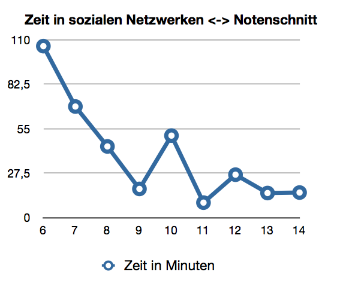
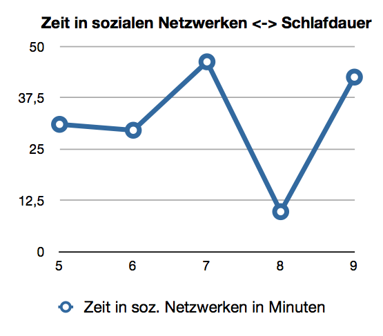
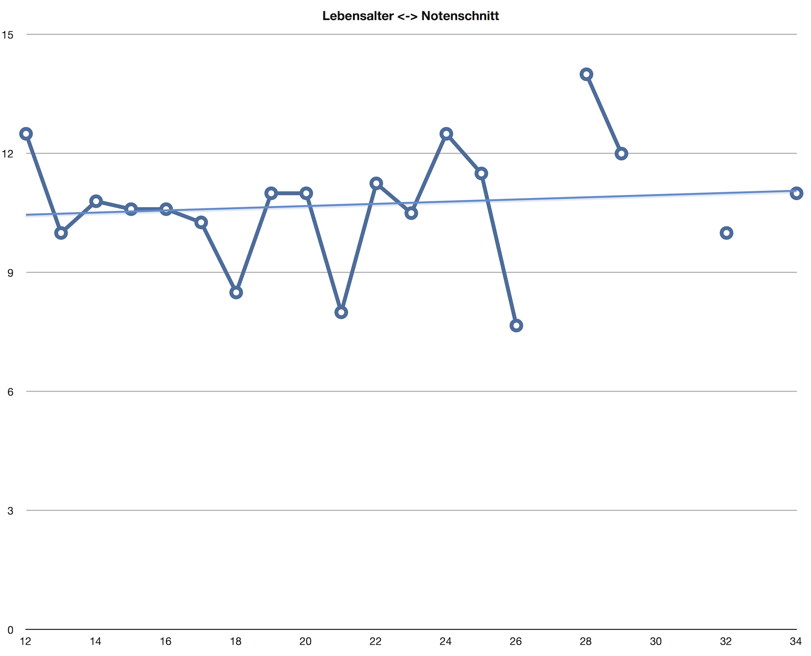
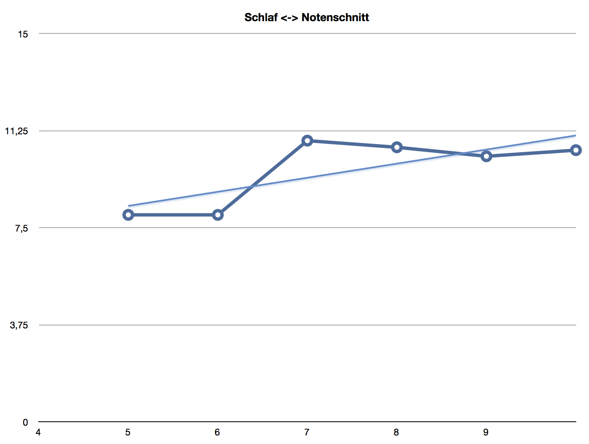

#Umfrageergbnisse
####Johannes Hertenstein

---

Vor beinahe einem ganzen Jahr produzierte ich ein Video, in welchem ich mich an meine Abonnenten wendete. Ich fragte, ob man bereit wäre an einer kurzen Umfrage teilzunehmen. Angekündigt wurde diese nur auf YouTube und Twitter.

Nach 3 Wochen hatte ich bereits mehr als 60 Teilnehmer, am Ende der Zeit waren es ungefähr 90.
In dem Video verprach ich, die Ergebnisse zu veröffentlichen, sobald ich sie habe. Jedoch muss ich zugeben, dass ich das etwas vergessen hatte, aber hier sind sie nun:

---
###Dumme Social Horses?

Dieses Ergebnis, muss ich ehrlich sagen, hat mich am meisten überrascht. Ich war eigentlich eher darauf aus zu beweisen, dass es keine Unterschiede im Notenschnitt macht, ob man nun 10 Minuten oder 3 Stunden in sozialen Netzwerken verbringt. Deshalb war das Ergebniss um so überraschender.

Je besser die Teilnehmer im Schnitt in der Schule abschneiden, desto weniger Zeit verbringen sie in sozialen Netzwerken. Um so viel mehr Sinn macht dies, wenn man das zweite Ergebnis meiner Ausarbeitung hinzuzieht:

 
---
###Schlaflose Social Horses?

Hiermit wollte ich eigentlich darauf hinaus zu beweisen, dass es ungesund ist sich viel in sozialen Netzwerken aufzuhalten, da man weniger schläft. Umso interresanter ist es, dass es hier kein erkennbares Muster gibt.

Das kombiniert mit dem ersten Schaubild lies mich darauf schließen, dass selbst wenn mehr Zeit in sozialen Netzwerken verbracht wird und gleich viel geschlafen wird, dabei die Zeit zum Lernen vernachlässigt wird, was dann zu einer schlechteren Note führt.

Die Aussagekräftigkeit der beiden Schaubilder ist anzweifelbar, da ich persönlich mich bei ungefähr 180-240 Minuten und 12 Punkten befinde, also komplett ausserhalb der Skale liege und damit kein Einzelfall bin.

 
---
###Verdummte Jugend?

Es ist mittags, 13 Uhr. Fröhlich verlässt man die Schule, froh um die dreiviertel Stunde Pause in denen man sich den Magen vollschlagen kann. An der nächsten Ecke warten schon 2 Rentner, die sich darüber beschweren, dass früher alles besser war und vorallem alle die Leute schlauer.

Und so leid es mir auch tut ich muss ihnen jetzt erstmal zustimmen, denn laut den Ergebnissen sinkt der Notenschnitt von ca. 10,6 Punkten bei 34-Jährigen bis auf 10,5 bei 12-Jährigen.

Hier ist die Frage: *Sind die Schüler dümmer geworden oder die Schule schwerer?* Wenn ich mitbekomme, was Grundschüler mittlerweile lernen müssen, wird mir fast bange (und meine Grundschulzeit ist auch noch keine Ewigkeit her). Ich stelle mal die Behauptung auf:

> Unsere Schüler sind schlauer geworden, aber die Schule schwerer, um das zu kompensieren

Eine andere Möglichkeit könnte natürlich auch folgendes sein: 

>„Die Schule ist realitästferner geworden bei der Benotung“ - (Yannik B.)

---
###Langschläfer sind faul und dumm

Ich als notorischer Langschläfer werde oft als faul bezeichnet und wenn ich Leuten erzähle, es sei gut für die Konzentration lange zu schlafen, werde ich müde belächelt. Doch hier ist der Beweis: Im Schnitt sind Schüler, die länger schlafen, besser in der Schule. Soviel zur Dummheit, zur Faulheit kann ich mich nicht äußern.

---
###Wie ist es ausgegangen?
Ich muss mich bei allen bedanken, die teilgenommen haben, es sind echt geniale Ergebnisse herraus gekommen.
Mein Lehrer war sehr beeindruckt mit der Umfrage, da andere nur ca. 50 Teilnehmer hatten.

Zusätzlich hatte ich kaum Arbeit damit, denn wo andere stundenlang durch Fußgängerzonen gehetzt sind um Teilnehmer zu finden, habe ich mich eine Stunde lang hingesetzt, die Umfrage programmiert und diese später noch eine Stunde lang ausgewertet.
Die Umfrage hat ihren Beitrag zur einer guten Note in meinem Seminarkurs (zum Thema "Auswirkung des Internets auf die Gesellschaft") - und damit meiner ersten Abiturnote - geleistet.
#Danke hier nochmal an alle Teilnehmer.