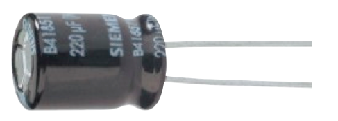
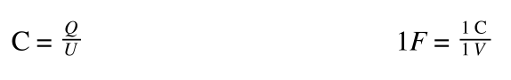

#Kondensatoren
---
Kondensatoren sind elektrische Bauteile, die Energie aufnehmen und speichern. ein Kondensator sieht typischerweise folgendermaßen aus:



Die Einheit, mit der ein Kondensator bezeichnet wird ist die elektr. Kapazität. Diese wird in Farad (F) gemessen und hat das Formelzeichen C.



Ein Kondensator der ein Coulomb bei einem Volt aufnehmen kann hat also die Kapazität von einem Farad


##Anwendungen
####1. Als Interferenzen Glätter
Durch die Eigenschaft, dass Kondensatoren wenn sie voll sind eine gleimäßige Menge an Strom abgeben, werden sie als Glätter für die Spannung benutzt.
####2. Als kurzzeitige (starke) Stromquelle
Durch die Speicherfunktion können Schaltungen bei kürzeren Spannungslecks trotzdem weiter Betrieben werden. Ausserdem kann die ganze Energie auf einmal entladen werden, wenn benötigt. Letzteres findet z.B. in der Medizin als Defibrilator und in der Fotografie als Blitzgerät eine Anwendung

---
&copy; Johannes Hertenstein
